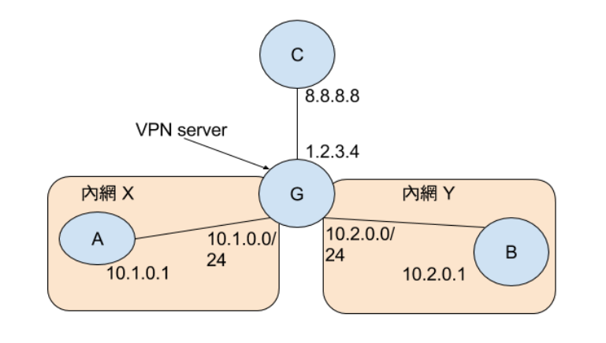

# Network Administration 
1. Explain what NAT is and how it works IN YOUR OWN WORDS. (10%)
* NAT 也就是一個當封包通過路由器或防火牆等設備時，轉換其封包內容的IP來源或目的。這個技術可以使得一個Public IP可以被多台機器所使用，但也會使得外面的機器沒辦法直接連到裡面的機器。
2. List some advantages and disadvantages of NAT. (10%)
* 好處是可以讓多台機器共用同樣的IPv4的IP ，但缺點則是會讓從外面不容易主動連線進來(但這有時也會是優點)
3. Your home server is behind a NAT router which is the Wi-Fi router in your house. The home server gets an IP address by DHCP and that IP address may change. On the other hand, the Wi-Fi router acquires a dynamic IP address from your ISP. What should you do to ensure that you can always connect to your home server from outside your home network? (Hint: adjust the DNS a little bit?) (10%)
* 使用DDNS來讓dynamic public IP可以自動的bind到一個domain name上面，然後就可以從外面透過那個DDNS連到ISP給你的IP了，然後再把裡面的機器換成固定IP，使用DMZ或是Port forwarding就可以了。
* 另外的做法是使用類似於P2P的軟體所使用的方式去穿透NAT，如UDP打洞之類的。
4. You want to connect to your home server’s HTTP service. The server is behind NAT and your IP address is 141.59.2.6. Write down the commands to set up a reverse SSH tunnel on your home server. (5%)
* ```ssh -NfR 9487:localhost:22 user@host```
5. Consider the following network topology (on next page). Node G is the NAT gateway of private network X and Y. G also acts as a VPN server which can create a tunnel accessing network Y. Node C and G both have public IPs. Please answer the following questions by writing down how packets pass through these nodes. Your answer should include the locations of the packet, the source IP address and the destination IP address of the packet in each location.
    
    1. Suppose that node C wants to communicate with node B. Node C has an IP address 10.2.0.2 on the Y network, which is assigned by the VPN server 1.2.3.4 (node G). (5%)
        ```
                   #--------------------------#
           C       | 8.8.8.8 to 1.2.3.4       |       G
        8.8.8.8 ---| #----------------------# |--> 1.2.3.4
                   | | 10.2.0.2 to 10.2.0.1 | |       |
                   | #----------------------# |       |
                   #--------------------------#       |
                                          #----------------------#
                                          | 10.2.0.2 to 10.2.0.1 |
                                          #----------------------#
                                                      |
                                                      v
                                                  10.2.0.1
                                                      B
        ```
    2. Suppose that node A wants to communicate with node B. Node A has an IP address 10.2.0.3 on the Y network, which is assigned by the VPN server 1.2.3.4 (node G). (5%)
        ```
                    #------------------------------#
            A       | 10.1.0.1 to 1.2.3.4(gateway) |       G
        10.1.0.1 ---|   #----------------------#   |--> 1.2.3.4
                    |   | 10.2.0.3 to 10.2.0.1 |   |   (gateway)
                    |   #----------------------#   |       |
                    #------------------------------#       |
                                                #----------------------#
                                                | 10.2.0.3 to 10.2.0.1 |
                                                #----------------------#
                                                           |
                                                           v
                                                       10.2.0.1
                                                           B
        ```