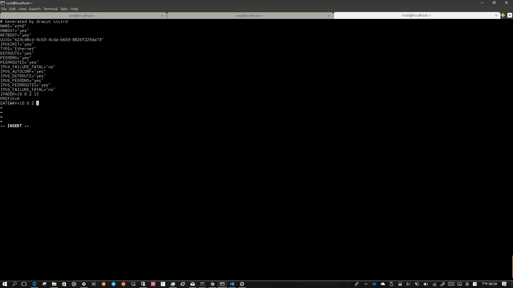
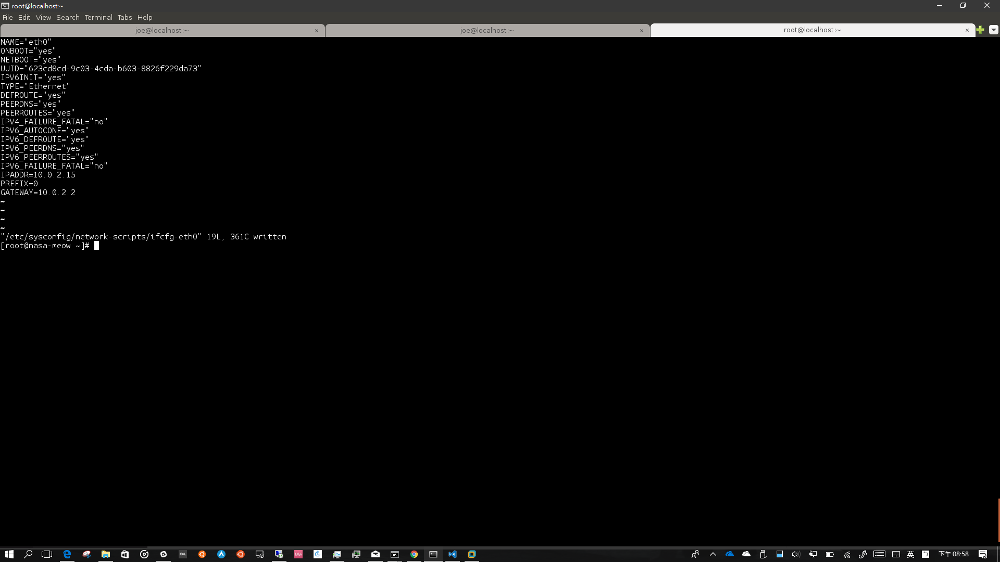
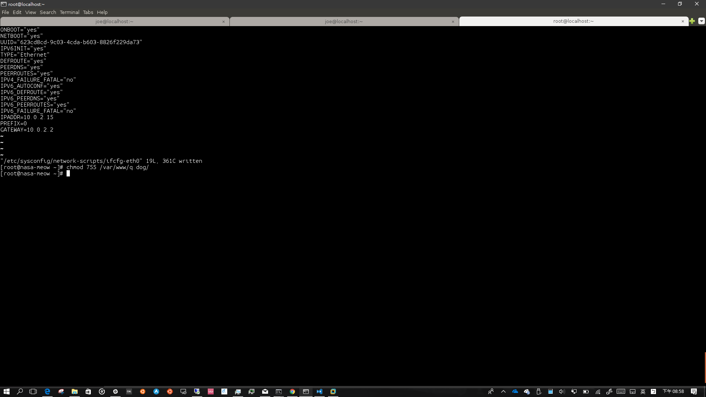
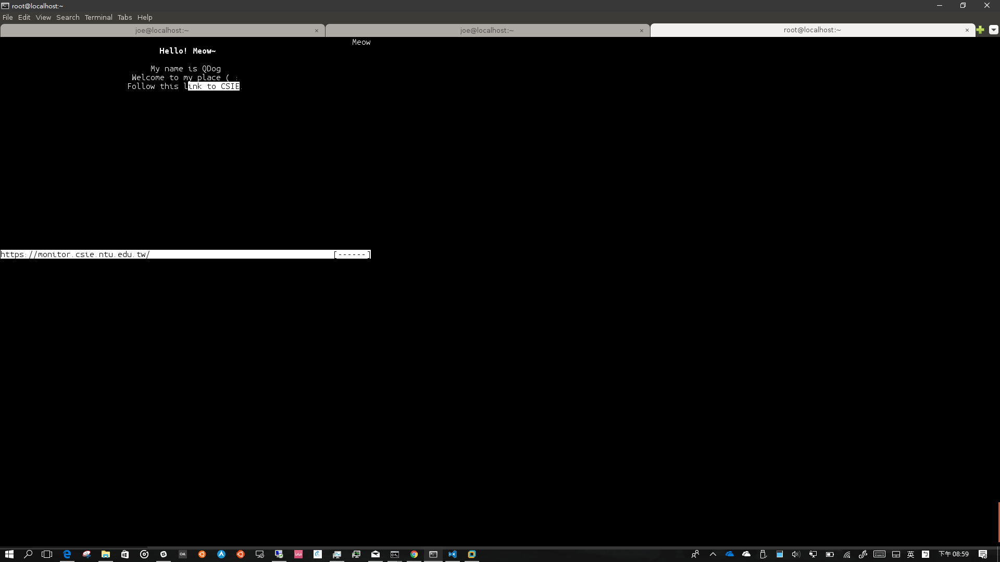
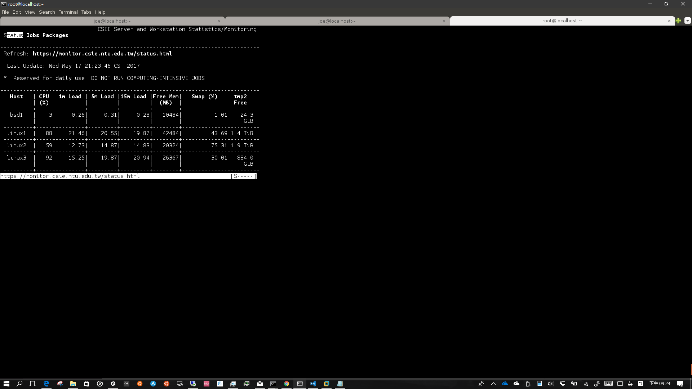

# System Administration
## FHS (15%)
1. Most UNIX software provides an autoconf script configure that can be run to determine the local build environment. It usually generates a Makefile so you can use the following commands to install a software in a portable manner (That’s why you can build the same software on FreeBSD, MacOS X, Linux, etc.):
    ```
    ./configure
    make
    make install
    ```
    The ```--prefix``` argument determines the installation path. The default installation path is ```/usr/local``` instead of ```/usr```. For example, the following commands will install the iperf executable to ```/usr/local/bin/iperf``` and the associated libraries into /usr/local/lib: 
    ```
    wget https://iperf.fr/download/source/iperf-3.1.3-source.tar.gz
    tar zxf iperf-3.1.3-source.tar.gz
    cd iperf-3.1.3
    ./configure; make; sudo make install
    ```
    Describe possible rationales for the decision of the default installation path, which is ```/usr/local``` instead of ```/usr```. Assume you are using CentOS 7. You can quote FHS if needed.
* 一般 Linux distribution 釋出安裝的軟體大多是在 ```/usr``` 裡面的，而一般使用者自行安裝的軟體則建議放置在 ```/usr/local``` 裡面。這樣的好處是可以比較容易去比較兩個不同的系統(但是同樣的發行版)所裝的程式的差異，方便不同的人去接管等等...
## Doge’s doom day (35%)
1. In NASA midterm problem 4, you have seen how Mr. Doge hacked Ms. Meow. Now, for fairness measure, I just messed up Mr. Doge’s own website, too. 
    You are given a clone of the broken virtual machine, in which Mr. Doge runs a website accessible by http://localhost:8080/q.dog/. The website contains a hyperlink to Doge’s favorite CSIE website.
    Now I have messed up the VM so it is your task to help Doge fix it.
    The success criteria are:
    * You can access Doge’s website by the command elinks http://localhost:8080/q.dog/.
    * Once you are able to view the web page, you should be able to visit the hyperlink, which links to Doge’s favorite CSIE website.
    Take a screenshot of each criterion as proof of completion and briefly describe what happens and what you have done to fix it. Please don’t steal others’screenshots. Cheating is a major crime!
    * The VM is at http://oasis2.csie.ntu.edu.tw:9999/nasa-doge-broken.qcow2.
    * Boot the VM with the following commands:
    ```
    # if you don't have root privilege on the running machine
    qemu-system-x86_64 -drive file=nasa-doge-broken.qcow2,format=qcow2,\
    if=virtio -net nic -net user -m 1024 -nographic
    # Might require root privilege on the running x86-64 machine.
    # This will use KVM to accelerate execution.
    qemu-system-x86_64 -enable-kvm -drive file=nasa-doge-broken.qcow2,format=qcow2,\
    if=virtio -net nic -net user -m 1024 -nographic
    # on some older CentOS ...
    /usr/libexec/qemu-kvm -drive file=nasa-doge-broken.qcow2,format=qcow2,\
    if=virtio -net nic -net user -m 1024 -nographic
    ```
    * The commands are available on CSIE workstations, and please, read the second tip here. Once you have finished this problem, it is wise to remove the disk image to save disk space. Please.
    * Upon first boot, You are able to log in only when the script firstboot.sh has been run. If you don’t have KVM acceleration, this will be a bit slow, so wait patiently at login prompt until you see messages like these:
    ```
    ...
    [ 114.011975] firstboot.sh[1076]: hello, my name is Doge
    [ 114.081861] firstboot.sh[1076]: my personal homepage is at http://localhost:8080/q.dog/
    [ 114.373270] firstboot.sh[1076]: access it with "elinks http://localhost:8080/q.dog/"
    [ 114.580865] firstboot.sh[1076]: if you see anything abnormal, please help fix it, because I ...
    [ 114.799595] firstboot.sh[1076]: because I am stupid
    [ 114.870771] firstboot.sh[1076]: the root password is "root" ( :
    ...
    ```
    * Use ctrl-a x to quit the QEMU window.
    * Hint: read the network configuration of QEMU user-mode networking carefully.
    * Hint: use systemctl to see if there is any failing service, or view log with journalctl.
* 開機登入之後會發現電腦網路怪怪的，然後去看一下網路的設定檔發現他gateway怪怪的

* 把它改成10.0.2.2後重新開機會發現網路就好了(能用curl、wget之類的，但是不能ping)

* 然後發現```/var/www/q.dog```這個資料夾的權限怪怪的，

* 把它改好權限後(755)，就能正常的使用達成目標了~

