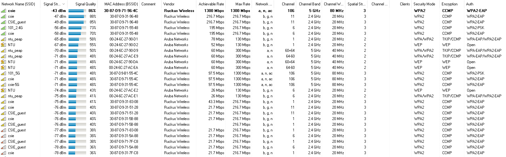

# Network Administration 
1. 2.5GHz vs. 5GHz 
    1. Why is 5GHz Wi-Fi theoretically faster than 2.4GHz Wi-Fi? (15%) 
        * 因為5GHz的Wi-Fi訊號寬度比較大(頻寬比較大)，因此比較能在同樣的時間內傳輸比較多的資料。
    2. When connecting to the same AP that supports both 2.4GHz band and 5GHz band, do you always transmit your data faster using 5GHz Wi-Fi than using 2.4GHz Wi-Fi? Please write down your reasons in detail. (15%)
        * 並沒有，因為5GHz的Wi-Fi訊號比較難穿透牆壁，因此在一些情況下5GHz的訊號會比2.4GHz還要差，而這時候使用2.4GHz的Wi-Fi訊號傳輸資料會比較快速。
2. Wi-Fi encryption 
    1. Find out the encryption method that CSIE wireless networks, ”csie” and ”csie-5G”, are using, and provide the evidence. (5%) 
        
        * 我們可以從圖中發現csie和csie-5G都是使用WPA2-EAP
    2. Provide the main differences between this encryption method and its older version, WPA. (7%)
        * WPA是WPA2的過渡版本，而其安全性也比較差一些，在2009年就已經有日本團隊宣布可以在15分鐘內破解的WPA的加密方法。而WPA的加密方法是由WEP所改良的，但是因為原本算法的缺點，因此他依然存在著弱點。
        * 而目前WPA2的破解方式還沒有使用字典檔暴力以外的作法。
    3. Compare the current encryption method in question 2-(1) to WEP, which is the older encryption method. Please identify one advantage and one disadvantage of the current encryption method. (8%)
        * WPA2相比WEP是比較新的加密方式，而WPA2的最大優點就是他目前還沒有良好的破解方法，WPA2的缺點主要就是比較舊的機器不支援，而且加密需要花比較多一點的時間。
