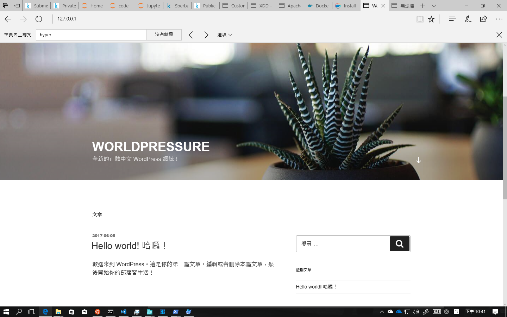

# System Administration
## Server status (15%)
1. mod_status is a apache module that allows adminstrators to monitor the server status. Try to turn the module on and enable it at /server-status. It should only allow the ip from the administor (you) to access. Please write down what you do step by step. NOTE: You should only use the Require directive, not the Allow and Deny directives. (They are used in the older version of apache.)
```
echo "LoadModule status_module modules/mod_status.so" >\
 /etc/httpd/conf.modules.d/vim 00-status.conf
sudo vim /etc/httpd/vim conf/httpd.conf 
#加入以下內容
<Location /server-status>
    SetHandler server-status
    Require all denied
    Require ip 192.168.1.233
</Location>
```
## A small taste of PHP (15%)
2. Try to write a page that will show the client’s ip.
```
<html>
    <head>
        <title>IP</title>
    </head>
    <body>
        <?php
        $myip = "";
        if(!empty($_SERVER['HTTP_CLIENT_IP'])){
            $myip = $_SERVER['HTTP_CLIENT_IP'];
            }
        else if(!empty($_SERVER['HTTP_X_FORWARDED_FOR'])){
            $myip = $_SERVER['HTTP_X_FORWARDED_FOR'];
            }
        else{
            $myip= $_SERVER['REMOTE_ADDR'];
            }
        echo "你的IP應該是:".$myip."<br>";
        echo "而最後一個節點的IP則是:".$_SERVER['REMOTE_ADDR'];
        ?>
    </body>
</html>
```
## Docker (15%)
3. In the class, we installed WordPress with LAMP in an old fashioned way which is using a VM to behave as a web server. There is a new light-weight virtualization solution called Docker. This task is easy. Try to install docker, get the WordPress Docker image, and then run it on your machine. Please write down how you achieve the task step by step.
* 為了讓指令比較有可移植性，因此這裡額外安裝了一個名為Docker Compose的項目(安裝方式:```https://yeasy.gitbooks.io/docker_practice/content/compose/install.html```)
* 安裝完後建立一個名為 ```docker-compose.yml``` 的檔案，而檔案內容如下
```
version: '2'
services:
    mariadb:
        image: mariadb
        restart: unless-stopped
        environment:
        - MYSQL_ROOT_PASSWORD="root"
        - MYSQL_DATABASE=wordpress
        volumes:
        - mysql:/var/lib/mysql
    wordpress:
        image: wordpress
        restart: unless-stopped
        depends_on:
        - mariadb
        links:
        - mariadb:mysql
        environment:
        - WORDPRESS_DB_PASSWORD="root"
        ports:
        - "80:80"
        volumes:
        - html:/var/www/html
volumes:
    mysql:
    html:
```
* 然後在這個當前目錄為包含此檔案的資料夾下 ```docker-compose up``` 這個指令後等他跑完就完成了。
